<h1 align="center">News Explosion</h1>

## Project Description

 This project is an news sharing application based around people sharing news they care about and hearing other people's thoughts.

The average user can view all posts and if they make an account they can to comment on posts.

Admins can make posts on topics they care about or want to share news on. They can also comment on any posts and approve comments whenever a user with an account makes one. 

# UX
## User Stories

## Strategy

## Scope

## Structure

## Skeleton
(Include wireframes and er diagrams. Could move this to design and make different sections.)

## Surface
(Mention color scheme)

# Features
## Existing Features
## Navigation Bar
* The navigation bar is provided at the top of the webpage to allow the user to easily explore the website and maintains a consistent look on across the website. The nav bar contains links to the home, login and registration pages when a user is not logged in. If a user is logged in a link for logging out replaces these links.

## Hero Image and Text
* The hero image has text overlayed on top of it to clearly give the user an immediate idea of the site's purpose.

## Card Posts
* Posts are displayed to the user underneath the hero image in cards. These cards show the post's hero image, the headline, the author, and the text in the post. This lets the user quickly decide whether or not this is a post they would like to click on.

## Post's Stories
* When a user clicks on a card post they are sent to page with the hero image and headline at the top and the body of text about the post below with the author similar to the card post.

## Commenting on Posts
* A comment section is displayed underneath the post so people can share their thoughts.

Users with accounts can comment on posts once an admin has approved the comment. Admins are also able to delete comments in case they change their mind.

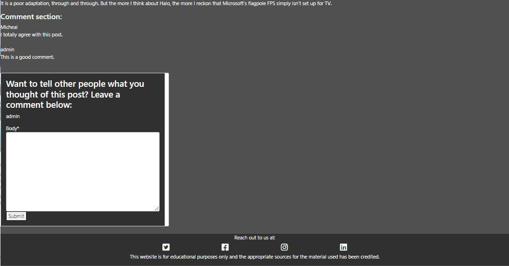

When a user has left a comment they are given an alert to notify them.

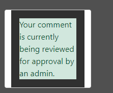

## Account Registration
### Registration Page
* This application allows the user to create an account to login and access additional features on the app. When registering the webpage will ask for a username (that doesn't already exist), an optional email, a password and the password a second time to confirm it. The webpage will detect the strength of the password entered to make sure it isn't too small or easy to figure out.

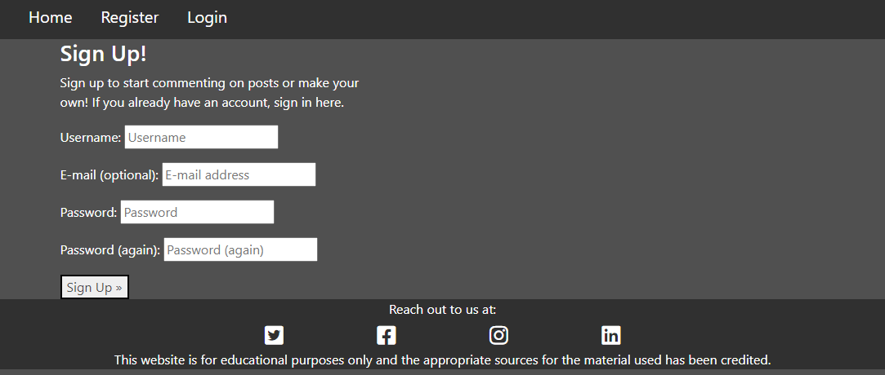

### Login Page
* Logging in lets the user leave comments on posts. The register and log in links are only in the navbar whenever the user isn't already logged in. When the user is logged in the navbar replaces register and login with logout to easily allow the user to sign out when they're done.

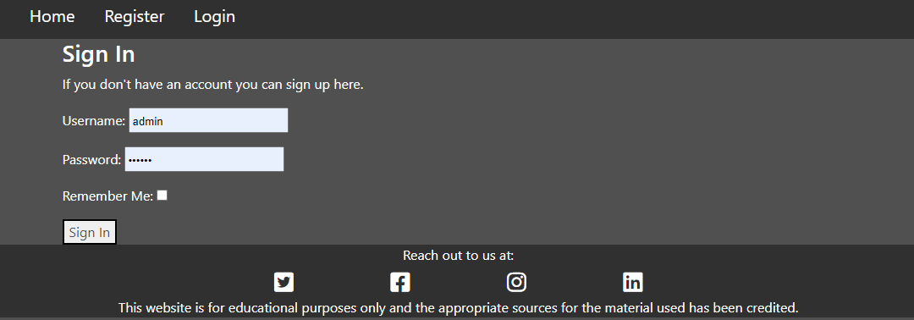

### Logout Page
* The logout page will ask the user if they are certain that they would like to logout and they must press a button to confirm this.

## Footer
* The footer is used to add authenticity to the website and to let people know that this is strictly for educational use only.
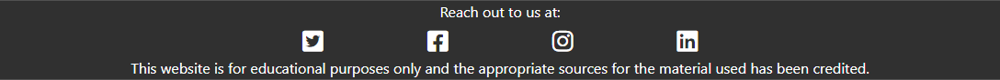

# Future Features to be added 
### Likes/Dislikes
* This would allow the user to like and dislike posts to and give people an indicator about whether they should read it or not.

### Post Filter
* Ideally a user could filter through different posts based on the type of new story it is e.g. (medical, tv, celebrity), how recent it is and the number of comments (interactivity) to give the user an easier time of navigating the website and posts.

### Dates
* This would allow users to see how relevant the post and comments are.

### Allow users to make posts
* Users would have much greater influence over the website through being able to leave posts.

### Restyling of admin pages
* The admin pages all add functionality to the wesbite but they don't match the website's theme or have its core features (navbar and footer).

# Technologies Used
## Languages Used
* HTML - A mark-up language that uses semantic structures.
* CSS - Cascade style sheets are used to style the quiz and website.
* Javascript - Programming language used to make the quiz.
* Python - Programming language used to create the databases, models and views for this website.

## Libraries, Frameworks and Programs
* Gitpod - Used as a platform for writing code. The command line commits and pushes to GitHub.
* GitHub - Used for agile development to track progress on the kanban board.
* Heroku - Cloud platform used to deploy this application and host the code.
* Flask - Used to make working with Python easier and faster.
* Django - Used for importing frameworks that sped up making the website.
* Bootstrap - Used to build webpages.
* Cloudinary - Used to display the images used on the website indefinitely.
* lucidchart - Used to create the entitiy relationship diagram for this project.
* Balsamiq - Used to make the wireframes for the webpages.
* Allauth - Used for account registration.
* Font Awesome - Used to include the icons in the footer.
* Google Fonts - Used to allow different fonts when creating posts.
* Gunicorn - Used as a server to help run on Heroku.
* Django Crispy Forms - Used to easily create forms for logging in.
* Django Summernote - Used for post creation.

# Design
## Wireframes
* These wireframes are for the home, post story, registration, login and logout pages. There are not wireframes for the Django admin pages used for creating posts, comments and comment approval.

Wireframes

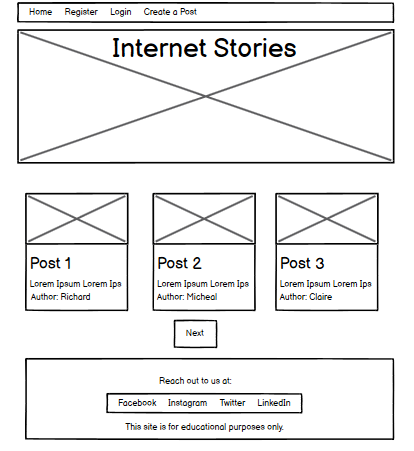

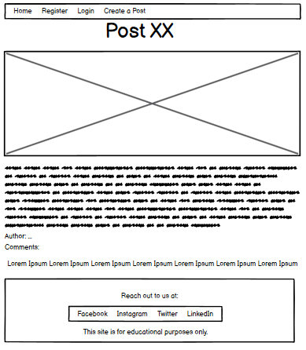

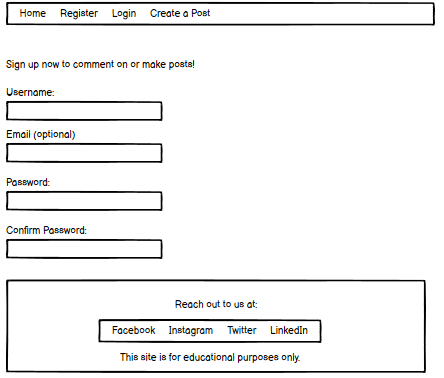

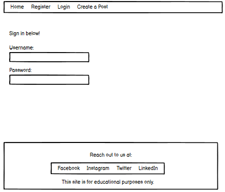

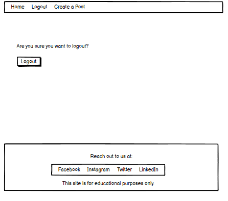

## Entity Relationship Diagrams
* The ER diagram shows the logic between the post and comments model with the author having a fixed ID that is used between the two. The relationship between the comments and author is a many-to-many relationship at both ends. 

* The relationship between the author and the posts and the posts and comments is one-to-many relationship.

* The likes, created_on and updated_on variables are data that wasn't used in the end.

Entity Relationship Diagram for Posts and Comments

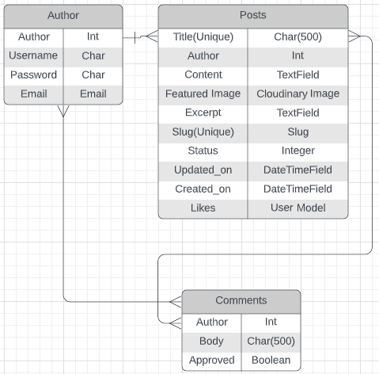

## Planning
* A Github project with issues was used as an Agile Tool for tracking progress on this project. The issues were tracked using a kanban board and were linked to an Epic that would show the over all goal of the issues.

# Testing
## Validator Testing
### HTML
* No errors or warnings were found through W3C validator.
### CSS
* No errors or warnings were found through the W3C CSS validator and I was given the code for this icon to prove this.

    

### Javascript
* JSHint returned no errors although it gave warnings that score isn't defined in the results function. This was used instead of correct which is equal to the same object. score.innertext was used instead because calling the correct from the checkAnswer function didn't work.

## Accessibility Testing
This is a screenshot taken from doing an accessibility test on Developer Tools Lighthouse.

* W3C HTML Validator - For cleaning and correcting HTML code.
* CSS Validator - For cleaning and correcting CSS code.
* JSHint - For cleaning and correcting Javascript code.
* Google Chrome Dev Tools - Used for Lighthouse to check and improve the website's accessability.
* WCAG Contrast Checker - For choosing accessible colours.
* Grammerly - For checking spelling and grammer.

## Manual Testing
I tested the media queries by manually adjusting the screen size from roughly 500-1000px to make sure the correct changes were taking place above or below each specific screen size.

For media queries, 768px, 500px, and below the text across the website is shrunk to maintain a clear structure on smaller screens and the logo was slightly adjusted. Media queries at sizes larger than this were only needed for the reset button to stay centred because the rest of the website was able to fill out the screen at these sizes well.

When checking the app on mobile I noticed that the font size was too large for both the header and questions making it so the user would need to scroll right to see the full question. This was fixed by shrinking the size of the text by 10%.

## Usability Testing
After I deployed this site I had friends and family test the usability of the website.

The first user asked to be able to see which question they were on. This was fixed by placing the question number in each question's text.

Another user asked for a way to restart the quiz at any time while they're going through it. This was addressed by adding a reset button above the question to make it easy for the user to see.

### What I think a user may have wanted:
* A way to keep track of the number of correct answers - added a scoreboard
* A way of knowing which button the user was on - added this by making buttons change colour when a mouse hovers over it.
* A confirmation for when an answer for a question is chosen - added an alert that comes up for each question when an answer is clicked.
* A way to view their results - added an alert at the top of the page telling them how well they did.
* A way to contact the site owner if they discover a bug - added a footer with relevant contact information.

## Known Bugs
When creating an option to be used the code will ask you for it twice. This doesn't happen if exit is used the first time the user is asked but if it is used when prompted the second time it will add this to the list. Using exit the first time won't add it to the list. I couldn't figure out why this problem happened.

# Deployment
This app was deployed using Heroku.
* Log into Heroku and make an account.
* In your gitpod code create a file called "requirements.txt" and add all of your code's dependencies to it.
* Go back to Heroku and click create new app. This app must have a unique name and a region.
* Now go to the Settings tab and scroll down to the Config Vars section. You will see two inputs called key and value.
* For the first key put CREDS and paste the contents of creds.json into value. 
* For the second key put PORT and "8000" into value.
* Scroll furthur down on this tab to Buildpack. 
* Click 'add Buildpack' and select Python. Do this again and select Node.js. Make sure Python is first and Node.js is second or it could affect your code.
* Go to the Deploy tab and you will see the deployment method, click Github. Enter the name of your repository and you will be given a list of the closest names that resemble what you have typed, click the one you want for this app.
* Scroll down to the Automatic Deploys section and click automatic deploy. This will make the app update to launch the latest cade that was pushed to Github everytime it is opened.
* You can also use Manual Deploy if this is the final version of your code.  
* Click Open App in the top right of the screen and the app should run.

## Forking
* Log into Github
* Load up the required repository.
* In the top right of the screen below the profile icon there is a fork button, click this.
* The repository should now be copied onto your Github account.

## Cloning
* Log into Github and choose a repository.
* Click on the green code button.
* You will be given three ways to clone the code. If you're using https, click “Clone with https” and copy the link.
* Open the terminal and type in the command "git clone" followed by a space and the copied url.
* The repository will now be cloned onto the computer.

# Acknowledgements
## Credits
* My mentor Brian Macharia who supported me and provided me with both feedback and solutions to problems I faced while creating the website.
* My lecturer Simen Daehlin helped me to better write my code to solve a couple of problems I had run into.
* Code institute for the classes, sources, and tutors that they provided me.
* Bootstrap for the media query sizes that I used: https://getbootstrap.com/docs/4.1/layout/overview/

## Content
* The placeholder text and image used in Post 1 about Halo were taken from https://www.pcgamer.com/the-halo-tv-series-has-absolutely-no-vibes/
* The placeholder text and image used in Post 2 about Dr Strange were taken from https://collider.com/doctor-strange-2-multiverse-of-madness-weekend-box-office-61-million/#:~:text=Doctor%20Strange%202%20opened%20to,Doctor%20Strange%20(%24232%20million).
* The placeholder text and image used in Post 3 about Johnny Depp were taken from https://www.nbcnews.com/pop-culture/pop-culture-news/johnny-depp-amber-heard-defamation-trial-summary-timeline-rcna26136
* The placeholder text and image used in Post 4 about covid affecting the elderly were taken from https://www.rte.ie/news/regional/2022/0520/1300146-ulster-covid/
* The placeholder text and image used in Post 5 about stress and anxiety in healthcare workers were taken from https://www.irishtimes.com/news/health/rising-number-of-healthcare-professionals-experiencing-stress-anxiety-burnout-1.4883048

## Media
* Placeholder image came from https://previews.123rf.com/images/sylverarts/sylverarts1710/sylverarts171000610/87432790-las-noticias-y-los-hechos-que-divulgan-el-logotipo-del-vector-compuso-usando-la-inscripci%C3%B3n-de-las-n.jpg
* Post 1's image came from https://cdn.mos.cms.futurecdn.net/pGyDmdniqHURMK2tN3Kh56-970-80.jpg.webp
* Post 2's image came from https://static1.colliderimages.com/wordpress/wp-content/uploads/2022/05/doctor-strange-2-multiverse-of-madness-review-feature.jpg?q=50&fit=contain&w=1500&h=&dpr=1.5
* Post 3's image came from https://media-cldnry.s-nbcnews.com/image/upload/t_fit-1240w,f_auto,q_auto:best/rockcms/2022-04/220427-johnny-depp-amber-heard-se-1207p-715327.jpg
* Post 4's image came from https://img.rasset.ie/001bc448-800.jpg
* Post 5's image came from https://www.irishtimes.com/polopoly_fs/1.4883047.1652971327!/image/image.jpg_gen/derivatives/box_620_330/image.jpg